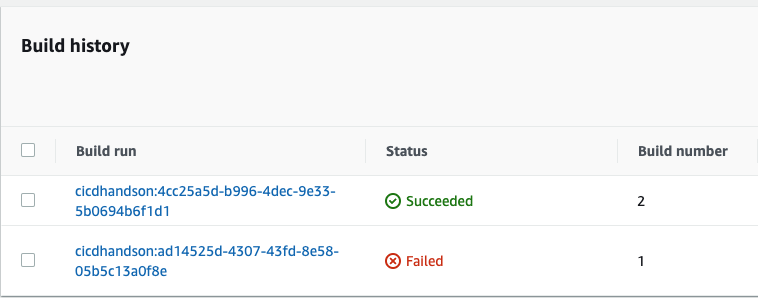

# part4

## 事前準備

[aws_happy_code - GitHub](https://github.com/ymd65536/aws_happy_code.git)をgitコマンドでDesktop上にcloneします。

## IAMユーザーを作成する

part5ディレクトリにある`iam_user.yml`を使ってハンズオンで利用するIAMユーザーを作成します。
※すでにAdministratorAccessで権限を作成されている場合はこの動作は不要です。

AWSマネジメントコンソールを開き、CloudFormationを検索します。


`create stack`をクリックします。


画面の内容に沿って`iam_user.yml`を指定します。`Next`をクリックします。


`cicdhandson-user`と入力して`Next`をクリックします。


`I acknowledge that AWS CloudFormation might create IAM resources with custom names.`にチェックを入れて`Submmit`をクリックします。


`CREATE_COMPLETE`と表示されましたら問題なくIAMユーザーが作成できています。


問題なくスタックが作成できましたら`Outputs`からアクセスキーとシークレットアクセスきーをコピーします。


## IAM Identity Centerを利用している場合

IAMユーザーを利用しておらず、既にIAM Identity Centerを設定している場合は以下のコマンドを実行することで次の手順に進めます。
`{Profile名}`にはご自分で作成したプロファイル名を指定します。

```sh
aws sso login --profile {Profile名}
```

プロファイル名は`credentials`を調べることでチェックできます。

```sh
cat ~/.aws/credentials 
```

### AWS　CLIをにIAMユーザーを記録する

AWS CLIを設定する為に以下のコマンドを実行します。

```sh
aws configure --profile cicd_handson
```

いくつか質問がなされるので順番に回答します。ここで先ほどのアクセスキーとシークレットアクセスキーを利用します。
`AWS Access Key Id`にアクセスキー、`AWS Secret Access Key`にシークレットアクセスキーを入力します。
リージョンはap-northeast-1、出力形式はjsonで問題ありません。


最後に設定されているかどうかを確認する為、`credentials`をチェックします。`[cicd_handson]`という項目が追加されていれば問題ありません。

```sh
cat ~/.aws/credentials 
```

## ハンズオン

### ディレクトリの変更

以下のコマンドを実行してディレクトリを変更します。本章ではpart4のディレクトリを利用します。

```sh
cd ~/Desktop/aws_happy_code/part4
```

### SAM build用のS3バケットを作成する

SAM build用のS3バケットを作成するために以下のコマンドで`s3.yml`をCloudFormationで実行します。

```sh
aws cloudformation deploy --stack-name s3-build --template-file ./sam-s3.yml --tags Name=cicdhandson --profile cicd_handson
```

コマンドを実行することによってS3バケットが作成されます。

### リポジトリを作成する

以下のコマンドで`codecommit.yml`をCloudFormationで実行します。

```sh
aws cloudformation deploy --stack-name codecommit --template-file ./codecommit.yml --tags Name=cicdhandson --profile cicd_handson
```

作成したCodcommitリポジトリでアプリケーションを管理します。

### CodeCommitのリポジトリをクローンする

Desktop上にCodeCommitのリポジトリをcloneします。
GitHubに馴染みのある方にとっては少し見慣れない文法かもしれませんが、CodeCommitのリポジトリをcloneするときは
`codecommit::リージョン名://プロファイル名@リポジトリ名`を実行することでリポジトリをcloneできます。

```sh
git clone codecommit::ap-northeast-1://cicd_handson@cicdhandson ~/Desktop/cicdhandson
```

cloneしたリポジトリを参照するため、ディレクトリを変更します。

```sh
cd ~/Desktop/cicdhandson
```

### mainブランチを作成

cloneしたばかりのリポジトリにはmainブランチがありません。
ハンズオンではmainブランチをデフォルトブランチとしてアプリケーションを記録します。main ブランチを作成します。

```sh
git checkout -b main
```

実行結果

```text
Switched to a new branch 'main'
```

mainブランチを説明する`README.md`を作成します。
WindowsやGUIによるファイル作成に慣れている人からすると違和感がある方法でファイルを作成していると思いますが、CLI上でファイルを作成する方法としては一般的な方法となるので覚えておきましょう。

```sh
echo "Hello SAM" > README.md
```

最後にリポジトリにファイルをpushします。
`git add`で変更をステージに移行、commitで変更を反映したら、push でCodeCommit上のリモートブランチを更新します。

```sh
git add .
git commit -m "part4"
git push -u 
```

### CodeBuild用 S3バケットの作成

CLI操作が可能なターミナルを開き、`aws_happy_code`リポジトリのpart4にディレクトリを変更します。

```sh
cd ~/Desktop/aws_happy_code/part4
```

以下のコマンドで`s3.yml`をCloudFormationで実行します。
このS3バケットはCodeBuildが作成するアーティファクト(ビルドしたファイルなど)を一時保存しておくディレクトリです。
CodeCommit上のファイルがCodePipelineを通してCodeBuildに伝わり、CodeBuildはCodeCommitのファイルをS3に保存します。

```sh
aws cloudformation deploy --stack-name s3 --template-file ./s3.yml --tags Name=cicdhandson --profile cicd_handson
```

### ハンズオンで利用するIAM Roleを作成する

以下のコマンドでCodeBuild用のIAM Role作成します。

```sh
aws cloudformation deploy --stack-name codebuild-iam-role --template-file ./codebuild-role.yml --tags Name=cicdhandson --capabilities CAPABILITY_NAMED_IAM --profile cicd_handson
```

作成したRoleによって関連のサービスにCodeBuildがアクセスできます。

※CodeBuildがアクセスするサービス一覧

- CloudFormation
- CodeDeploy
- IAM
- Lambda
- S3
- CloudWatch Logs

実行結果

```text
...(一部省略)
Successfully created/updated stack - codebuild-iam-role
```

以下のコマンドを実行してEventBridge用のIAM Role作成します。この RoleはCodePipelineで利用します。
CodePipelineを実行する際にCodeCommitの変更を検知する必要があるのですが、その際にこのIAM Roleが必要になります。

```sh
aws cloudformation deploy --stack-name event-bridge-iam-role --template-file ./event-bridge-iam-role.yml --tags Name=cicdhandson --capabilities CAPABILITY_NAMED_IAM --profile cicd_handson
```

実行結果

```text
...(一部省略)
Successfully created/updated stack - event-bridge-iam-role
```

以下のコマンドを実行してCodePipeline用のIAM Role作成します。CodePipelineは各サービスを束ねる役割あるため、束ねるサービスのIAM Policyが必要です。
なお、CodeDeployやLambda、CloudFormationを利用していますが、CodePipelineでは直接触れないため、IAM Policyは不要です。

```sh
aws cloudformation deploy --stack-name pipeline-iam-role --template-file ./pipeline-iam-role.yml --tags Name=cicdhandson --capabilities CAPABILITY_NAMED_IAM --profile cicd_handson
```

実行結果

```text
...(一部省略)
Successfully created/updated stack - pipeline-iam-role
```

### CodeBuildのプロジェクトを作成する

CodeBuildのプロジェクトを作成します。プロジェクトには必ず一つのビルドが含まれます。
以下のコマンドで`code-build.yml`をCloudFormationで実行します。

```sh
aws cloudformation deploy --stack-name code-build --template-file ./code-build.yml --tags Name=cicdhandson --profile cicd_handson
```

### CodePipeline の環境構築

CloudFormationでCodePipelineを構築します。
以下のコマンドで`pipeline.yml`をCloudFormationで実行します。

CodePipelineの構築が完了するとPipelineが動作しますが、ここでは動作に失敗します。

```sh
aws cloudformation deploy --stack-name pipeline --template-file ./pipeline.yml --tags Name=cicdhandson --profile cicd_handson
```

### sam_handsonブランチを切る

リポジトリを参照するため、ディレクトリを変更します。

```sh
cd ~/Desktop/cicdhandson
```

新しいブランチでビルドを実行する為にCodeBuild用に新しくブランチを切ります。
ハンズオンではmainブランチをビルド対象としています。ゆえにmainブランチを変更するのではなくmainブランチをソースに別のブランチを作成します。
作成したブランチで変更を管理します。

```sh
git checkout -b sam_handson
```

### buildspec.ymlを作成する

CodeBuildで利用する設定ファイル(`buildspec.yml`)を作成します。
part4ディレクトリにあるbuildspec.ymlを`cicd_handson`リポジトリにコピーします。

```sh
cp ~/Desktop/aws_happy_code/part4/buildspec.yml ~/Desktop/cicdhandson/
```

`buildspec.yml`にはSAMアプリケーションをパッケージするコマンドとデプロイするコマンドが含まれています。

### SAMのパッケージをコピーする

今回はAWSの公式ドキュメントに記載されている`SAM-Tutorial`をCodeBuildで実行します。
ソースコードをCodeCommitリポジトリにコピーします。

```sh
cp ~/Desktop/aws_happy_code/part4/SAM-Tutorial/* ~/Desktop/cicdhandson/
```

### リモートリポジトリを更新する

CodeCommitのリモートリポジトリにdockerfileをpushします。
リモートリポジトリにブランチを追加します。
補足となりますが、リモートブランチを追加する時は`--set-upstream`をつけることでブランチを追加できます。

```sh
git add .
git commit -m "part4"
git push --set-upstream origin sam_handson
```

### プルリクエストを作成する

変更をmainブランチにマージするためにCodeCommit上でプルリクエストを作成します。

```sh
# プルリクエストを作成する
aws codecommit create-pull-request --title "part4" --description "part4 lambda ci/cd" --targets repositoryName=cicdhandson,sourceReference=sam_handson --profile cicd_handson
```

```sh
# プルリクエストIDを環境変数PULL_REQUEST_IDに保存する
PULL_REQUEST_ID=`aws codecommit list-pull-requests --profile cicd_handson --pull-request-status OPEN --repository-name cicdhandson --query 'pullRequestIds' --output text` && echo $PULL_REQUEST_ID
```

```sh
# リビジョンIDを環境変数REVISIONIDに保存する
REVISIONID=`aws codecommit get-pull-request --pull-request-id $PULL_REQUEST_ID --profile cicd_handson --query 'pullRequest.revisionId' --output text` && echo $REVISIONID
```

```sh
# コミットIDを環境変数COMMITIDに保存する
COMMITID=`aws codecommit get-branch --repository-name cicdhandson --branch-name sam_handson --profile cicd_handson --query 'branch.commitId' --output text` && echo $COMMITID
```

### ブランチをマージする

PULL_REQUEST_IDとCOMMITIDを元にブランチをマージします。
マージするとCodePipelineが動作します。AWSマネジメントコンソールを参照するとPipelineの動作を確認できます。
[リンク](https://ap-northeast-1.console.aws.amazon.com/codesuite/codepipeline/pipelines)

```sh
aws codecommit merge-pull-request-by-fast-forward --pull-request-id $PULL_REQUEST_ID --source-commit-id $COMMITID --repository-name cicdhandson --profile cicd_handson
```

およそ3分程度でデプロイが完了します。CodeBuildのBuild history に`Succeeded`と表示されていれば、問題ありません。


### CodeDeployでアプリケーションをデプロイ

ここまででAWSにアプリケーションをデプロイできました。初回のデプロイではCodeDeployがどのようにデプロイするのかを確認できません。
CodeDeployの動作を確認するためにはもう一度デプロイ動作を繰り返す必要があります。

ソースコードやREADMEを修正するかリポジトリにファイルを追加します。追加したことをトリガーにデプロイを再実行します。

新しくターミナルを開いて、`cicdhandson`リポジトリにディレクトリを変更します。

```sh
cd ~/Desktop/cicdhandson
```

利用するブランチを変更します。

```sh
git checkout sam_handson
```

README.mdを以下のコマンドで更新します。

```sh
echo "# Hello SAM" > README.md
```

リモートリポジトリを更新します。

```sh
git add .
git commit -m "codedeploy"
git push -u 
```

### プルリクエストを作成する(2回目)

変更をmainブランチにマージするためにCodeCommit上でプルリクエストを作成します。

```sh
# プルリクエストを作成する
aws codecommit create-pull-request --title "CodeDeploy" --description "codedeploy deploy" --targets repositoryName=cicdhandson,sourceReference=sam_handson --profile cicd_handson
```

```sh
# プルリクエストIDを環境変数PULL_REQUEST_IDに保存する
PULL_REQUEST_ID=`aws codecommit list-pull-requests --profile cicd_handson --pull-request-status OPEN --repository-name cicdhandson --query 'pullRequestIds' --output text` && echo $PULL_REQUEST_ID
```

```sh
# リビジョンIDを環境変数REVISIONIDに保存する
REVISIONID=`aws codecommit get-pull-request --pull-request-id $PULL_REQUEST_ID --profile cicd_handson --query 'pullRequest.revisionId' --output text` && echo $REVISIONID
```

```sh
# コミットIDを環境変数COMMITIDに保存する
COMMITID=`aws codecommit get-branch --repository-name cicdhandson --branch-name sam_handson --profile cicd_handson --query 'branch.commitId' --output text` && echo $COMMITID
```

### ブランチをマージする(2回目)

PULL_REQUEST_IDとCOMMITIDを元にブランチをマージします。
マージするとCodePipelineが動作します。AWSマネジメントコンソールを参照するとPipelineの動作を確認できます。
[リンク](https://ap-northeast-1.console.aws.amazon.com/codesuite/codepipeline/pipelines)

```sh
aws codecommit merge-pull-request-by-fast-forward --pull-request-id $PULL_REQUEST_ID --source-commit-id $COMMITID --repository-name cicdhandson --profile cicd_handson
```

### CodeDeployで動作を見る

CodePipelineが動作している際にCodeDeployの画面を開くとアプリケーションへのトラフィックが徐々に移行していることがわかります。
[CodeDeployのリンク](https://ap-northeast-1.console.aws.amazon.com/codesuite/codedeploy/deployments)

※トラフィックが徐々に移行していることがわかる画面


## まとめ

これでハンズオンは以上です。
CodeBuild、CodeDeployを利用することで簡単にLambdaのデプロイができるようになります。
このハンズオンで注目すべき点としてはAWSが推奨する様々なデプロイ方法をCodeDeployで制御できるところでしょう。

ハンズオンでは1分ごとにトラフィックを移行して徐々に古いLambdaから新しいLambdaに入れ換えることができます。
デプロイ方法はSAMの`template.yml`にある`DeploymentPreference`セクションに記載されていますので興味のある方は他のデプロイ方法を試してみると良いでしょう。
